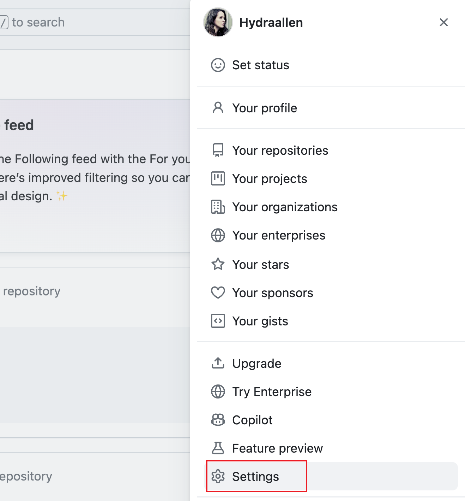
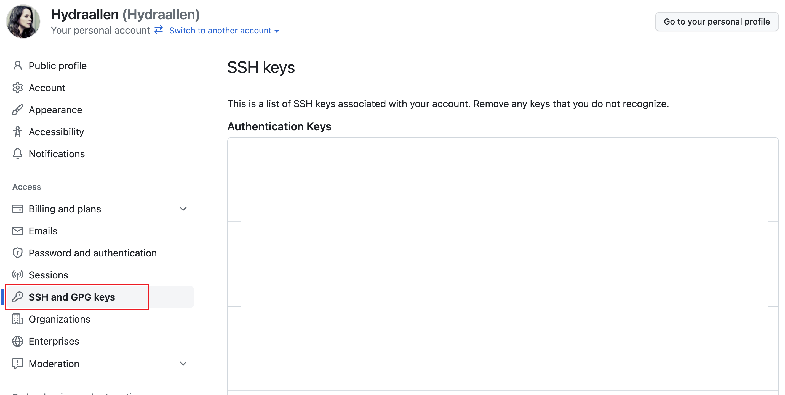
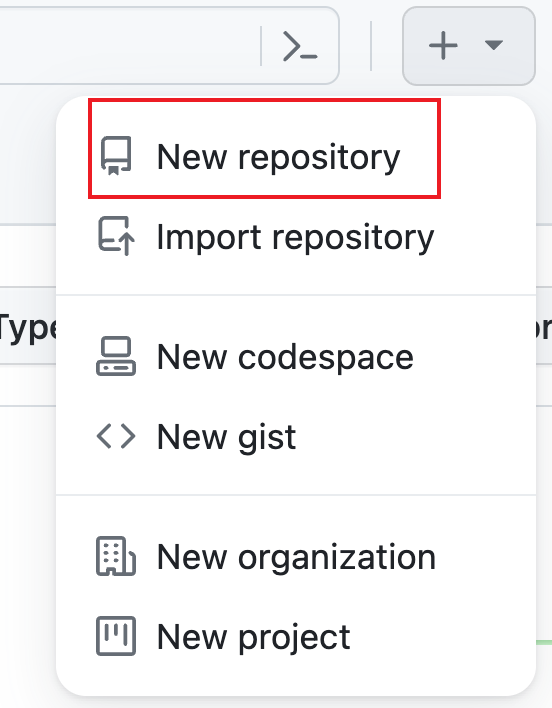
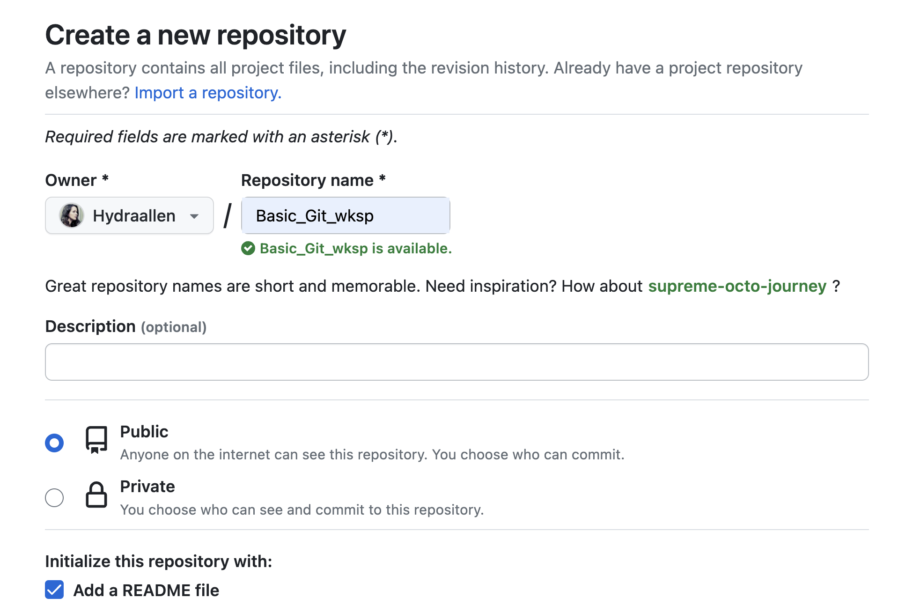
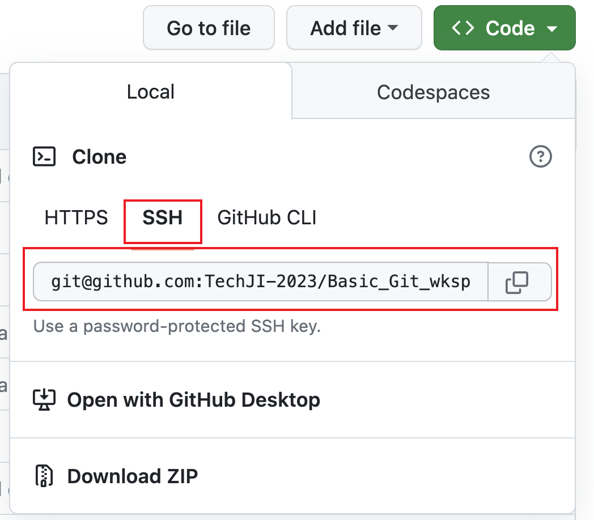

# Github配置

GitHub是一个在线软件源代码托管服务平台，使用Git作为版本控制软件。

### 注册一个Github账号

前往[Github](https://github.com)创建一个账号(Sign Up): 


### 简单配置Git

> Note: 从这一步开始，windows用户建议在桌面右键，然后在菜单里面选择**Git Bash Here**。这是一个刚刚下载下来的git自带的命令行。Linux和macOS使用系统自带的terminal。

#### 配置用户名和密码

打开命令行，输入以下两条命令（输一条敲一次回车，不要复制`$`）:

```bash
$ git config --global user.name "your_username"
$ git config --global user.email "your@email.com"
```

注意，`your_username`替换为你刚刚Github账号的用户名，`your@email.com`替换为你注册用的邮箱。（外面的双引号需保留）

### 配置ssh-key并关联Github

#### 生成ssh-key

简单来说，这一步是为了能让Github验证你的身份，让你能顺利的下载和上传代码。ssh-key是一种密码，通常保存在两个文件中，分别是私钥和公钥。公钥分享给他人，用于验证你的身份；私钥需要自己妥善保存，不可分享给他人。

同样还是在命令行里，运行（不要复制`$`）：

```bash
$ ssh-keygen -t rsa -C "your@email.com"
```

同样的这里要替换成你刚刚注册用的邮箱。然后会要你依次输入一些信息，如果你不想管，可以一路`enter`下去。这些依次输入参数的具体含义如下：

* 保存ssh-key文件的路径：默认在~/.ssh下，如果你记不住就不要改。
* Passphrase：密码，一般没什么用，只有在某些需要用到你的key的时候需要输入。一般留空即可。
* 确认Passphrase：如果上一步设置了密码，就再打一遍确认。


当你看到一串奇怪的字符画出现的时候，说明你创建成功了。

#### 上传ssh-key

首先，你需要找到你刚刚创建的key。依次运行以下两条命令（不要复制`$`）：

```bash
$ cd ~/.ssh
$ cat id_rsa.pub
```

意义分别是：

* `cd ~/.ssh`: 进入一个叫`.ssh`的文件夹，前面的`~`代表你的用户目录。（如果你是windows且使用了cmd，打开一个新的cmd并且`cd .ssh`即可）
* `cat id_rsa.pub`: 显示文件`id_rsa.pub`的内容，也就是你的公钥。（如果使用了cmd，请将cat换成type)


然后，登陆到Github，去右上角找到你的账号settings里的SSH and GPG keys，选择增加一个新的ssh-key，title可以随便输入你喜欢的名字，底下的打输入框中，复制你刚刚在命令行中打印出来的公钥内容(从"ssh-rsa"开始一直到你的邮箱结束)。然后点击底部按钮即可添加完成。

> Note: 不要复制成你的私钥`id_rsa`。私钥比公钥要长的多。






#### 验证一下

然后我们简单的验证一下。还是在页面右上角，点击那个加号，选择New Repository，新建一个代码仓库。



`Repository name`是你的项目名字，不可以有空格。`Description`是你的项目描述。`Public`代表任何人都能看到这个项目，`Private`代表只有你自己能看到这个项目。最后，建议选择“Initialize this repository with a README”，这样项目创建的时候会自己带一个Readme文件。



然后会跳转到新项目的主页，找到页面上唯一一个绿色按钮，点下去，然后再点图中的按钮，将你的项目地址复制到剪贴板。

> 这里尽量复制以git@开头的地址，如果你默认显示的地址是https开头的，点use SSH就可以看见了。



最后，回到你的命令行，依次运行以下命令（#号后面的不用复制，不要复制`$`）：

```bash
$ cd ~/Desktop                      # 进入桌面
$ git clone <your_repo_address>     # clone你刚刚创建的项目
```

注意`<your_repo_address>`要替换成你刚刚复制的项目地址，**不要有尖括号或者双引号**。

可能会跳出来一个问你是否继续连接的提示，输入`yes`并回车就好了。

然后过了一会，等它运行完成，你就会在桌面上看到一个以你项目为名字的文件夹，内容就是你刚刚创建的项目。至此，说明你安装并配置Git成功了。

现在，**你已经可以使用命令行来操作git并完成所有的版本控制的功能了**。

### 安装一个你喜欢的Git GUI（Optinal）

Git GUI简单来说就是**一类**可以免去你敲命令行的痛苦的桌面软件。它与Git的关系仅仅是锦上添花，没有GUI软件你照样可以用命令行里的Git完成所有操作。当然GUI软件会增加一些实用的工具。

>  GUI软件仅仅是一层壳，它所进行的所有操作仍然是在背后默默的调用命令行里的`git`命令。

这里推荐一些：

+ [Lazygit](https://github.com/jesseduffield/lazygit) (Windows, Mac, Linux) -> 可以参考本仓库内`Installation_Lazygit.md`

* Sourcetree (Windows, Mac)
* GitKraken (Windows, Mac, Linux)

这几个总体易于操作，较为稳定，而且都是免费的。
